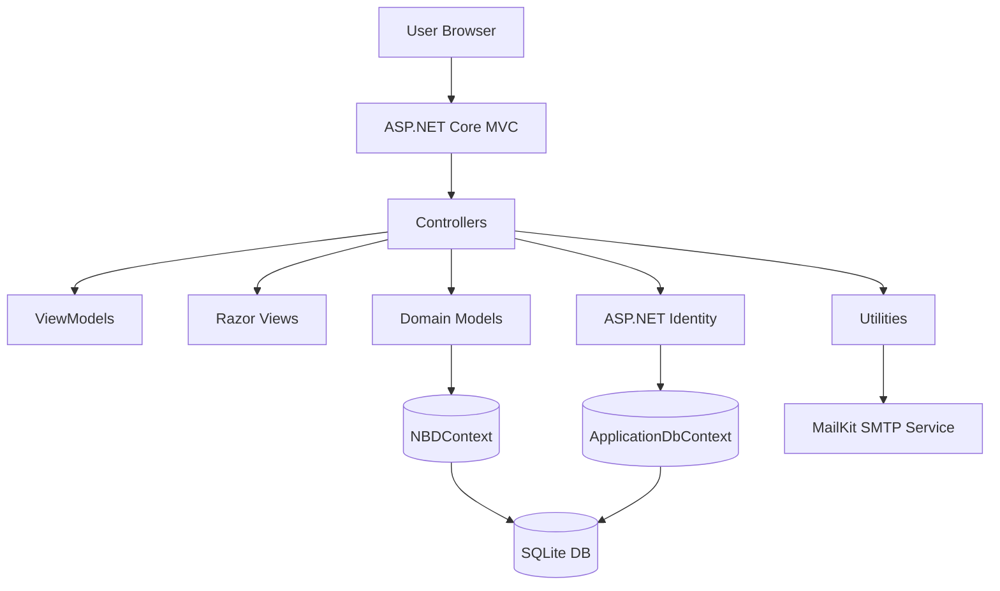

# NBD Landscaping Management Platform

An enterprise-style ASP.NET Core MVC web application for landscaping operations, designed to manage the full commercial pipeline from customer onboarding to project planning and bid composition.

This project is portfolio-ready and focused on real business workflows for client, project, and bid management.

---

## Overview

NBD Landscaping Management Platform is a role-based internal web system that helps a landscaping company coordinate:

- Client relationship data
- Project definitions and scheduling windows
- Bid construction per project
- Itemized material and labour line items within bids
- Employee profiles and account lifecycle
- Role assignment and access governance

From a business perspective, the app models a typical landscaping sales and delivery process:

1. Register a client profile.
2. Create one or more projects for that client.
3. Build bids for each project.
4. Assign material and labour entries to each bid.
5. Manage who can create, update, approve, or maintain data according to role.

The project combines practical production concerns (auth, role policies, paging/filtering, validation, concurrency) with domain-specific workflows (estimating and planning).

---

## The Solution

### Core Product Scope

The solution is split into functional modules:

- Client Management
- Project Management
- Bid Management
- Material and Labour Lookups
- Employee and User Administration
- Identity and Security

Each module is implemented as ASP.NET MVC controllers and Razor views with Entity Framework Core persistence.

### Technology Stack

- ASP.NET Core MVC (.NET 8)
- Entity Framework Core 8
- ASP.NET Core Identity with roles
- SQLite for persistence
- Razor Pages (Identity UI area) + MVC views
- Bootstrap UI + jQuery + Select2
- MailKit for SMTP email services

### Data Model Highlights

The domain model includes the following key entities:

- Client
- Project
- Bid
- Material
- Labour
- BidMaterial (join/line item)
- BidLabour (join/line item)
- Employee
- City
- Province
- Subscription

The most important relationship chain:

- One Client -> many Projects
- One Project -> many Bids
- One Bid -> many BidMaterials and BidLabours

This structure supports real-world estimating where each proposal contains granular quantities/hours and unit prices.

### Security and Access Control

Role-based authorization is implemented across controllers and actions with roles:

- Admin
- Supervisor
- Sales
- Designer

Patterns in access policy:

- Broad read access for operational roles
- Create/Edit/Delete restricted by role
- Additional ownership checks in delete operations for some roles

This allows collaboration while preserving governance and accountability.

### Auditing and Concurrency

The application includes auditable entities and optimistic concurrency controls:

- Audit fields updated automatically during SaveChanges
- Timestamp row versions for conflict detection on editable entities

This reduces accidental overwrites and improves traceability in multi-user scenarios.

### Navigation and Usability Layer

The app includes several quality-of-life patterns:

- Return URL persistence in custom base controllers
- Controller-specific page size preference via cookies
- Query-based filtering and sorting on list views
- Server-side paging utility to keep list rendering fast

These patterns improve user efficiency for day-to-day records management.

---

## Why It Matters

Landscaping operations often fail at handoff points between sales, planning, and administration. This platform addresses that directly by introducing a unified operational model:

- Sales can reliably create customer records and opportunities.
- Operations can schedule and refine project scopes.
- Estimating can produce structured bids with transparent cost components.
- Leadership can control access and maintain data quality.

The system is not only CRUD; it enforces process order and role responsibility, which is what turns data entry into operational execution.

---

## Impact on Productivity

### 1) Reduced Operational Friction

The app centralizes fragmented tasks in one interface and one data model. Teams no longer need to reconcile separate spreadsheets or ad hoc records.

### 2) Faster Data Retrieval

Filter, sort, and paging are implemented on major modules (Clients, Projects, Bids), reducing search time for high-volume records.

### 3) Role-Driven Workflows

Users only see what they should act on, reducing accidental edits and shortening training curves.

### 4) Better Data Integrity

Validation attributes, unique constraints, and referential rules improve data quality and lower cleanup effort.

### 5) Safer Concurrent Editing

RowVersion concurrency handling reduces silent overwrites during parallel updates.

### 6) Operational Consistency

The system enforces consistent role-based behavior and predictable data-entry steps, reducing variability across users.

---

## Architecture

### Architectural Style

This solution follows a layered MVC architecture:

- Presentation Layer: Controllers + Razor Views
- Application/Workflow Layer: Controller action orchestration, role checks, paging/sorting/filtering logic
- Data Access Layer: EF Core DbContexts, entity configuration, migrations, seeders
- Infrastructure Layer: Email services, cookie helpers, utility helpers

### High-Level Diagram

### Runtime Composition

- Program startup registers two EF contexts using the configured connection string:
  - ApplicationDbContext for Identity
  - NBDContext for business domain data
- Identity is configured with roles and cookie policy.
- MVC and Razor Pages are enabled.
- Development-only seed routine populates baseline data and roles.

### Controller Strategy

Custom base controllers provide reusable behavior:

- CognizantController: standard ViewData metadata
- ElephantController: return URL persistence and index cookie reset
- LookupsController: lookup-tab return routing

This avoids repeated code across feature controllers.

### Data Access Strategy

- EF Core with SQLite provider
- Fluent API indexes and delete behavior configuration
- Restrictive cascade rules for critical parent entities
- AsNoTracking on read-heavy listing scenarios

### Identity and Role Governance

- ASP.NET Core Identity with RoleManager/UserManager
- UserRole controller for role assignment UI
- Employee controller syncs employee records with Identity accounts

### Email Subsystem

- Identity email sender implementation for account/security flows
- Custom email sender for business messaging and invitations
- SMTP backed by MailKit and configuration-bound options

## Documentation — How to Use

### 1) Demo Access Credentials

Use the following credentials to evaluate the system as an administrator:

- Email: admin@outlook.com
- Password: Pa55w@rd

### 2) First Login and Entry Point

1. Open the application URL.
2. Click Login in the top-right navigation.
3. Enter the admin credentials.
4. After login, use the main navigation menu to access Clients, Projects, Bids, and Employees.

### 3) What You Can Do in the System

As an Admin, you can perform the full operational cycle:

- Manage clients and their contact/location data
- Create and maintain projects linked to clients
- Build and edit bids linked to projects
- Add labour and material details to bids
- Manage lookup catalogs (Materials and Labours)
- Manage employee records and identity roles
- Review and update your own profile/account area

### 4) Detailed User Walkthrough

#### Step A: Client Management

Go to Clients and use this module to:

1. Create a new client profile with personal/company/contact information.
2. Search by name, company, phone, address, city, province, or postal code.
3. Filter by city and sort by client, company, city, or phone.
4. Open Details to view linked projects for that client.
5. Edit client information when details change.

Business value: this is the canonical source of customer data before creating project work.

#### Step B: Project Management

Go to Projects and use this module to:

1. Create a project and link it to an existing client.
2. Define project name, site, start date, estimated completion date, and setup notes.
3. Filter projects by date range and client.
4. Search by project fields and related client/location fields.
5. Sort by project name, dates, site, city, or client.

Business value: projects represent scoped work packages for which bids are prepared.

#### Step C: Bid Management

Go to Bids and use this module to:

1. Create a bid linked to a project.
2. Edit bid date and linked project.
3. Attach labour and material entries through related workflows.
4. Review bid records with filtering, sorting, and pagination.
5. Open details to inspect the full bid context.

Business value: bids centralize estimated work and cost components before execution.

#### Step D: Materials and Labours Catalog

Go to Lookup (Materials and Labours) and maintain catalogs used by bids:

1. Create and edit labour types with descriptions and hourly prices.
2. Create and edit material types with descriptions and unit prices.
3. Remove items when not referenced by dependent records.

Business value: standardized catalogs improve consistency and speed in bid creation.

#### Step E: Employee and Role Administration

Go to Employees (Admin only) and use this module to:

1. Create employee records.
2. Assign one or more platform roles.
3. Activate/deactivate employee access.
4. Maintain contact data and role permissions over time.

Business value: aligns organizational responsibilities with application access control.

### 5) Role Behavior Reference

- Admin
  - Full access across the platform, including employee and role administration.
- Supervisor
  - Operational access to clients, projects, bids, and lookup data.
- Sales
  - Client/project/bid participation with role-specific constraints.
- Designer
  - Project and bid composition with role-specific constraints.

### 6) Practical Usage Tips for Reviewers

To evaluate the project quickly as a portfolio reviewer:

1. Log in with the admin credentials.
2. Visit Clients and create one sample client.
3. Visit Projects and create one project for that client.
4. Visit Bids and create one bid for the new project.
5. Visit Lookup and inspect available materials/labours.
6. Visit Employees to confirm admin-level governance features.

### 7) Data Integrity and UX Behaviors You Should Notice

- Strong input validation on core forms.
- Unique constraints for key records.
- Concurrency safeguards on editable entities.
- Pagination, sorting, and filtering on list-heavy modules.
- Role-based menu visibility and action-level authorization.

---

## Future Potential

This platform already demonstrates strong enterprise patterns and can be expanded into a production-grade vertical SaaS with the following roadmap:

### 1) Performance and Scale

- Move from SQLite to Azure SQL Database in production.
- Add caching for hot read scenarios.
- Introduce background workers for long-running jobs.
- Enable health checks and Always On for reduced cold starts.

### 2) Security Hardening

- Externalize all secrets to Key Vault.
- Introduce centralized authorization policies.
- Add structured security logging and audit trail views.

### 3) Product Enhancements

- Bid approval workflow with explicit statuses and transitions.
- PDF proposal generation and branded exports.
- Customer communication history and notification tracking.
- Cost analytics dashboards and profitability reporting.

### 4) Engineering Maturity

- Add automated unit/integration tests.
- Add CI/CD pipeline (build, test, deploy gates).
- Introduce code quality checks and dependency vulnerability scanning.
- Improve error handling consistency and telemetry.

### 5) Multi-Tenant / Commercial Readiness

- Tenant isolation model for multiple landscaping businesses.
- Subscription plans and feature flags.
- Branded portals and configurable workflows.

---

## Repository Structure (Key Areas)

- NBDProject2024/Controllers: MVC feature controllers
- NBDProject2024/CustomControllers: reusable controller base classes
- NBDProject2024/Data: DbContexts, initializers, migrations
- NBDProject2024/Models: domain entities and validation rules
- NBDProject2024/ViewModels: UI projection models
- NBDProject2024/Views: Razor UI by module
- NBDProject2024/Utilities: helpers (paging, cookies, URL state, email)
- NBDProject2024/Areas/Identity: Identity UI scaffolding

---

## Final Notes

This project demonstrates full-stack web engineering fundamentals expected in a professional operations platform:

- Business-centric data modeling
- Controlled access by role
- Enterprise-grade CRUD workflows
- Practical maintainability patterns

It is a strong portfolio artifact because it combines realistic domain process modeling with real-world deployment and administration concerns.
